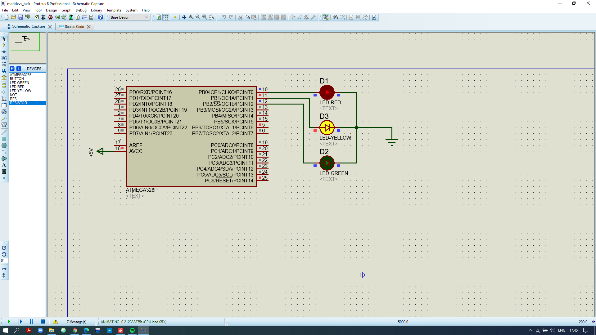
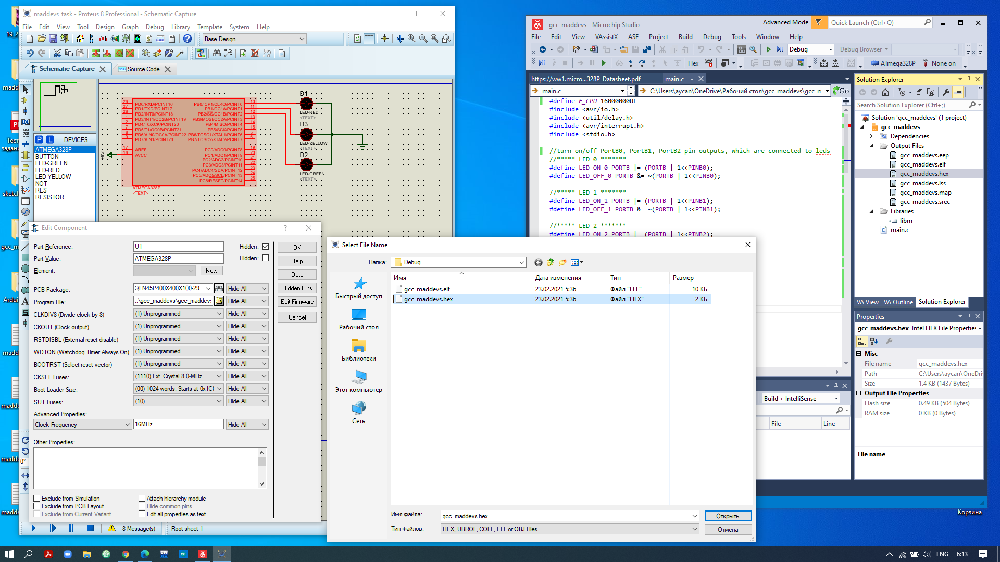

# task_electronics_mdevs

# Problem Description:
Control of 3 individual leds with different blinking frequency and dimming ratio parameters

# Solution
ATMega328p(Arduino) MCU is feeded with +5V Power Supply. 
PortB0, PortB1, PortB2 pins are set as an output.\
PINB0 = redLed 5mm \
PINB1 = yellowLed 5mm \
PINB2 = greenLed 5mm

The given duty cycle values are used to controll the led dimming ratios.
The both led blinking frequency and pwm parameters are handled using Timer0, Timer1, Timer2 timers for each led relatively.
Each timer uses 2 prescaler register(OCRxA, OCRxB) with frequency and duty cycle values.

# Requirements
1) Proteus 8 Professional
2) Microchip Studio 7 (Version: 7.0.2542), AVR package

* Project Schematics\
\
* ATMega328p(Arduino) MCU schematics is driven using .hex compilation result of AVR C-code\

